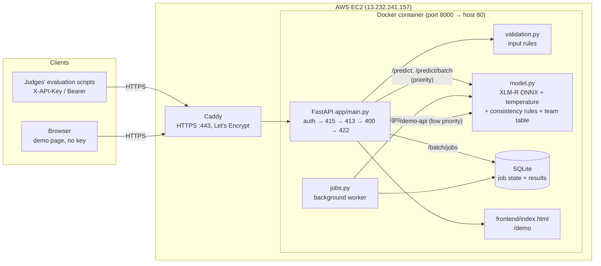

# TensorForge 2.0 — Phase 2: Support Ticket Classifier

Classifies RideEat customer support tickets (English, Sinhala, Tamil, Singlish, Tanglish, mixed) into:

1. `category` — the main issue (11 classes), which fixes the `team` it is routed to
2. `secondary_category` — a second issue, or `null`
3. `is_urgent` — needs immediate human attention

The model is our own fine-tuned multilingual transformer (no LLM API calls), served by a FastAPI service that
follows the official OpenAPI contract in `api/`.

| | |
|---|---|
| **Hosted API** | https://13-232-241-157.sslip.io (AWS EC2, valid Let's Encrypt TLS) |
| **Demo website** | https://13-232-241-157.sslip.io/demo/ (no key needed, see [Demo website](#demo-website)) |
| **API docs** | https://13-232-241-157.sslip.io/docs |
| **Container** | `docker run -p 8000:8000 -e API_KEY=<key> <image>` |

## Results (validation set, 800 tickets)

| Model | Category accuracy | Category macro-F1 | Secondary macro-F1 | Urgent F1 | All three correct |
|---|---|---|---|---|---|
| TF-IDF + logistic regression (`notebooks/01_baseline.py`) | 0.604 | 0.631 | 0.668 | 0.841 | 0.564 |
| Best classical variant: TF-IDF + linear SVM (`notebooks/04_experiments.py`) | 0.646 | — | — | — | — |
| **Fine-tuned XLM-RoBERTa, 3 heads, served** (`notebooks/02_transformer_colab.ipynb`) | **0.853** | **0.851** | **0.877** | **0.969** | **0.834** |

Confidence is calibrated (expected calibration error 0.106 → 0.025, see [Confidence](#confidence-and-needs_human_review)).
Served as fp32 ONNX on CPU. In Docker with `--cpus 2 --memory 4g --network none` (the reference hardware):
`/predict` ~130 ms, 100-ticket batch 14 s, 5,000-ticket job ~13–15 min, `/predict` p95 614 ms while a job runs,
1.7 GB RAM.

EDA, the full experiment log, per-class and per-language scores, the confusion matrix and the calibration check
are in [`reports/`](reports/README.md), with the key findings.

## Architecture



- **One model, three heads.** A single XLM-R encoder reads `channel | subject` + `text` and predicts category,
  secondary category and urgency in one pass.
- **Rules after the model, never learned.** `model.py` maps category to team with the fixed table from the spec,
  makes `secondary_category` differ from `category`, and makes spam non-urgent with no secondary.
- **Live requests first.** `/predict` and `/predict/batch` run before async-job and demo work, so they stay fast
  while a 5,000-ticket job runs. Threads follow the container's CPU limit.
- **Jobs survive restarts.** Job state and results live in SQLite. A job running during a restart ends as
  `failed` with `error.code = interrupted`, never silently lost.

## How the model was trained

All scripts use fixed seeds (42) and run from the project root.

| Step | Script | What it does |
|---|---|---|
| 1. EDA | `notebooks/03_eda.py` | Class, language, length, urgency and secondary-label counts; duplicate and nearest-neighbour checks → `reports/eda_summary.md`, `reports/figures/eda_*.png` |
| 2. Baseline | `notebooks/01_baseline.py` | TF-IDF (character 2–5 + word 1–2 n-grams) + logistic regression with class weights, one model per output; urgency threshold tuned by 5-fold CV on train → `model/baseline.joblib` (0.604) |
| 3. Classical experiments | `notebooks/04_experiments.py` | Words vs characters, class weights, regularisation, linear SVM, with/without channel and subject. 5-fold CV on train + validation score for each → `reports/experiments.csv` |
| 4. Transformer | `notebooks/02_transformer_colab.ipynb` (Colab T4 GPU) | Fine-tunes `xlm-roberta-base` with three heads (below), two seeds, picks the best epoch on validation, exports fp32 ONNX → `model/xlmr/` (0.853) |
| 5. Calibration | `notebooks/06_calibrate.py` | Fits one temperature for the category confidence (T = 1.75) → `app/calibration.json` |
| 6. Final evaluation | `notebooks/05_evaluate.py` | Runs the served models through `app/model.py` on validation → `reports/metrics.json`, confusion matrix, per-class/per-language scores, calibration chart |

**Transformer details.** `xlm-roberta-base` (multilingual, covers Sinhala and Tamil), mean pooling over tokens,
three linear heads: category (11 classes), secondary (12: `none` + 11) and urgent (1, sigmoid). Loss = category
cross-entropy + 0.5 × secondary cross-entropy + 0.5 × urgent binary cross-entropy, with softened inverse-frequency
class weights for rare classes (safety, spam, urgent). AdamW, learning rate 2e-5 (3e-5 was unstable: 0.828 and
0.775 on two identical runs), 10% warmup, batch 16, max 256 tokens (the longest ticket is 230), 8 epochs, seeds
42 and 1337. The checkpoint kept is the one with the best `category_F1 + 0.3 × urgent_F1 + 0.2 × secondary_F1` on
validation (seed 42, epoch 6). The urgency threshold (0.45) is tuned on validation for F1.

**What we learned on the way** (details in [`reports/README.md`](reports/README.md)):
- Random k-fold CV on train is misleading: classical models score ~98% there but 53–65% on validation, because
  train contains close paraphrases. Models are compared on validation.
- Character n-grams beat words (0.630 vs 0.527) because Singlish, Tanglish and native-script spelling varies.
- The fine-tuned transformer beats every classical model by 20+ points, in every language.
- int8 quantisation cost 3–4 points of accuracy, so the served model stays fp32.
- The raw model was over-confident (96% average confidence at 85% accuracy); temperature scaling fixed it.

The 1.1 GB model is not in git. It is attached to the GitHub release `model-xlmr-v1` with a SHA-256 checksum, and
`scripts/download_model.py` fetches and verifies it.

## Run locally

```bash
# one-time setup
uv venv .venv && uv pip install --python .venv/bin/python -r requirements-dev.txt
cp .env.example .env          # put the real API key in .env — never commit it

# get the XLM-R model (1.1 GB, GitHub release, checksum verified)
python3 scripts/download_model.py

# start the API, then open http://localhost:8000/docs or http://localhost:8000/demo/
set -a && . ./.env && set +a && .venv/bin/uvicorn app.main:app --port 8000
```

Without `model/xlmr/` the API falls back to the baseline (`model_version` starts with `baseline-`).
`MODEL_PATH` picks a model explicitly.

Regenerate every report and figure: see [`reports/README.md`](reports/README.md).

## Docker

The model is copied into the image at build time, so nothing is downloaded at runtime.

```bash
python3 scripts/download_model.py
docker build -t tensorforge .
docker run -p 8000:8000 -e API_KEY=<key> tensorforge

# offline check: no network at all, reference hardware limits
docker run --rm --network none --cpus 2 --memory 4g -e API_KEY=test123 tensorforge
```

`python:3.13-slim`, non-root user, one uvicorn worker (async job state is shared through SQLite), `HEALTHCHECK`
on `/health`. Measured: `/health` returns `200` about 4 seconds after start (the spec allows 120), and the
smoke test passes 252/252 against a container started with the exact command above.

## Testing

```bash
.venv/bin/python -m pytest -q                                   # 64 contract tests
API_KEY=<key> .venv/bin/python scripts/smoke_test.py <base-url>  # ~250 checks against any running server
```

- **`tests/test_api.py`** validates every response, including every error, against the official JSON Schemas in
  `api/` (`jsonschema`, draft 2020-12). It covers: auth on every protected endpoint (missing, wrong, Bearer) and
  public `/health`; check order; 400/413/415/422 errors; the edge cases (empty or whitespace text, 10,000-character
  text, emoji-only, mixed scripts, unknown fields, duplicate or missing `ticket_id`, empty and oversized batches);
  batch order and position independence; the full async job flow (submit, idempotency, poll, results, paging,
  delete, 404/409/410/429, restart → `interrupted`); that the ONNX model matches the training notebook's
  probabilities; that calibration never changes a prediction; and the demo routes.
- **`scripts/smoke_test.py`** runs the same kind of checks over HTTP against any base URL, including a real async
  job on validation tickets (it reports the hosted model's accuracy). It passes 252/252 against the hosted URL.

## API

| Method | Path | Auth |
|---|---|---|
| GET | `/health` | public |
| POST | `/predict` | API key |
| POST | `/predict/batch` | API key (1–100 tickets) |
| POST | `/batch/jobs` | API key (1–5,000 tickets) |
| GET | `/batch/jobs/{job_id}` | API key |
| GET | `/batch/jobs/{job_id}/results` | API key (`offset`, `limit` paging) |
| DELETE | `/batch/jobs/{job_id}` | API key |

Send the key as `X-API-Key: <key>` or `Authorization: Bearer <key>`. The service reads it only from the
`API_KEY` environment variable and compares it in constant time. If `API_KEY` is unset, every protected endpoint
returns `401`. Every error, including 404/405 for unknown routes, uses the spec's
`{"error": {"code", "message", "details"}}` format; the API never returns a 5xx for bad input.

| File | Job |
|---|---|
| `app/main.py` | Endpoints, API key check, error format. Checks run in the spec order: auth → content type → size → JSON → validation |
| `app/validation.py` | Input rules (channel values, empty text, lengths, batch `index` details, duplicate ids) |
| `app/model.py` | Loads XLM-R (ONNX) or the baseline, applies calibration and the consistency rules. Threads follow the container's CPU limit; live requests go before job work |
| `app/features.py` | Builds the model input from `channel`, `subject`, `text` (shared with training) |
| `app/jobs.py` | Async jobs in SQLite; a background worker processes them in small chunks |

`model_version` is the model name, the first 12 characters of the model file's SHA-256 hash and the calibration
temperature (`xlmr-5e87460a8fb6-T1.75`), so it identifies the exact artifact. It is the same in `/health`,
`/predict`, `/predict/batch` and job results.

### Confidence and `needs_human_review`

`confidence` is the calibrated probability of the primary category. The raw model said 96% on average while
being right 85% of the time. Dividing its logits by T = 1.75 (`app/calibration.json`, fitted by
`notebooks/06_calibrate.py`) changes no prediction, but brings the average to 87% and the calibration error from
0.106 to 0.025 (measured on held-out folds).

`needs_human_review` is `true` when the calibrated confidence is below **0.5**. That flags about 5% of validation
tickets, of which only 19% are correct; the auto-routed rest are 89% correct.

### Demo website

`/demo/` is a single page (`frontend/index.html`): classify one ticket (category, team, urgency, confidence), or
upload a CSV/JSONL of up to 1,000 tickets to see the team split and, if the file has labels, accuracy per category
and a confusion matrix.

The page never holds the API key. It calls two extra routes, `POST /demo-api/predict` and
`POST /demo-api/predict/batch` (not part of the contract, hidden from `/docs`), which run the same model
server-side with limits so they can never get in the way of the official endpoints: background priority (a live
`/predict` always runs first), no use of the job queue, at most 50 tickets per call and 600 tickets per minute per
client. They are off when `API_KEY` is unset, and `DEMO_PUBLIC=0` turns them off entirely.

## Deployment

The hosted service runs on an AWS EC2 instance (`c7i-flex.large`, 2 vCPU, 4 GB, Ubuntu 24.04) with an Elastic IP:

- The API container is built on the server from `Dockerfile.space`. It is the same as `Dockerfile`, but the model is
  pulled at build time from a private Hugging Face repo with a read-only token passed as a build secret. It runs
  with `-p 80:8000 --env-file .env --restart unless-stopped`; the key lives only in the server's `.env`.
- Caddy (`caddy:2`, host network) serves HTTPS on port 443 for `13-232-241-157.sslip.io`, with an automatic
  Let's Encrypt certificate, and forwards to the container.
- The security group allows ports 80 and 443 from anywhere, and SSH only from the deployer's IP.
- Redeploy: copy `app/` and `frontend/`, rebuild, replace the container (about 6 seconds of downtime), then run
  `scripts/smoke_test.py` against the HTTPS URL.

## Folder layout

```
api/         official OpenAPI spec + JSON schemas (do not edit)
app/         FastAPI service (+ calibration.json)
data/        dataset (train / validation) + DATA_NOTES.md
frontend/    demo website
model/       baseline.joblib (in git) + xlmr/ (1.1 GB, downloaded by scripts/download_model.py)
notebooks/   training, experiments, evaluation (01–06) + report_style.py
reports/     EDA, experiment log, metrics, figures (generated)
scripts/     download_model.py, smoke_test.py, deploy_hf_space.py
tests/       contract tests
Dockerfile   local / submitted image (model copied in)
Dockerfile.space  hosted image (model pulled at build time)
```
